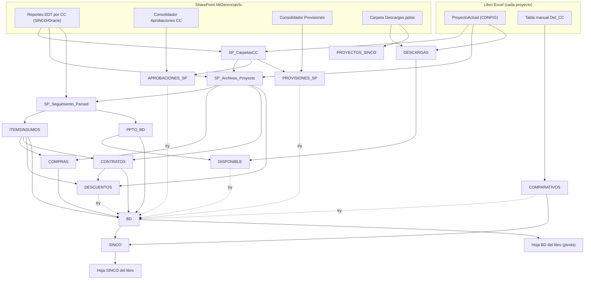

# PowerQuery-Gestion-Costos

Repositorio central del código Power Query (lenguaje M) que alimenta los libros **"Control interno"** de los proyectos de vivienda (BOSQUE DE TURPIAL, PAYANDE, KARAKALI, PAMPLONA 1, LA ARBOLEDA, BOSQUE DE ARRAYAN, VERDE ESPERANZA...).

**Regla de oro: el código vive AQUÍ, no en los libros.** Cada libro de Excel solo contiene "stubs" de una línea (`FxGitHub("BD")`, `FxGitHub("COMPARATIVOS")`, etc.) que al refrescar descargan el `.m` correspondiente desde `raw.githubusercontent.com` (rama `main`, carpeta `Consultas/`). Un cambio aquí aplica a **todos los proyectos** en su próximo "Actualizar todo" — no hay que tocar libro por libro.

```
Editar Consultas/X.m → commit → push a main → los libros lo toman en el próximo refresh
```

---

## 1. Fuentes de datos (de dónde viene todo)

| Fuente | Ubicación | Qué aporta | Consultas que la leen |
|---|---|---|---|
| **Reportes EDT por Centro de Costos** (exportados de SINCO/Oracle) | SharePoint `MiGerenciaViv` → `Departamento Tecnico/COORDINACION DE PRESUPUESTOS/0. Reportes EDT - Control costos interno/<CC>/` | Seguimiento por ítems (ppto/proyectado/consumido), compras, contratos, entradas, salidas | `SP_CarpetasCC`, `SP_Archivos_Proyecto`, `SP_Seguimiento_Parsed`, `COMPRAS`, `CONTRATOS`, `DESCUENTOS`, `* SINCO` |
| **Consolidador de aprobaciones CC** (lo llena Coordinación) | SharePoint → `0. CC approvals (solo aprobado) - Control costos interno/0. CONSOLIDADOR APROBACIONES CC SP.xlsx` | Cuadros comparativos aprobados: `# CC`, proveedor, `Cant. Total`, `V/U TOTAL`, `VR TOTAL` | `APROBACIONES_SP` |
| **Consolidador de provisiones** | SharePoint → `0. Provisiones - Control costos interno/0. CONSOLIDADOR PROVISIONES SP.xlsx` | Provisiones por proyecto | `PROVISIONES_SP` |
| **Descargas de presupuesto** | SharePoint → `0. Descargas pptos - Control costos interno/<PROYECTO>.xlsx` | Tabla DESCARGA del ppto; además la lista de archivos define los proyectos disponibles | `DESCARGAS`, `PROYECTOS_SINCO` |
| **Tabla manual `Det_CC`** (en el libro, hoja Comparativos) | Cada libro Excel | Detalle manual de cuadros comparativos: aprobaciones, clasificador, comparativo | `COMPARATIVOS` |
| **Celda/hoja CONFIG del libro** | Cada libro Excel | `ProyectoActual` (nombre del proyecto que filtra todo) | casi todas |

## 2. Mapa de dependencias (quién alimenta a quién)



Las flechas punteadas (`try`) significan: si esa consulta falla, `BD` sigue funcionando sin esas filas (degradación suave, no error).

## 3. Qué hace cada consulta

| Consulta | Rol | Fuente directa | La consume |
|---|---|---|---|
| `F_Globales` | Biblioteca de funciones compartidas (limpieza de texto, números, lectura SharePoint, parseo de seguimiento). **No trae datos.** | — | casi todas |
| `SP_CarpetasCC` | Lista las carpetas (= Centros de Costos) del proyecto actual en Reportes EDT | SharePoint EDT | `SP_Archivos_Proyecto`, `APROBACIONES_SP`, `PROVISIONES_SP`, `* SINCO` |
| `SP_Archivos_Proyecto` | Índice de archivos por CC (qué SEGUIMIENTO/INFORMEORDEN/etc. hay) | SharePoint EDT | `SP_Seguimiento_Parsed`, `COMPRAS`, `CONTRATOS`, `DESCUENTOS` |
| `SP_Seguimiento_Parsed` | Parsea los archivos "SEGUIMIENTO POR ITEMS" (ppto + APU) una sola vez | SharePoint EDT | `ITEMSINSUMOS`, `PPTO_BD` |
| `ITEMSINSUMOS` | Relación ítem→insumo del seguimiento | `SP_Seguimiento_Parsed` | `COMPRAS`, `CONTRATOS`, `DESCUENTOS`, `BD` |
| `PPTO_BD` | Presupuesto por ítem (tipo PPTO/ITEMS) | `SP_Seguimiento_Parsed` | `BD`, `DISPONIBLE` |
| `COMPRAS` | Compras + entradas + salidas por insumo (INFORMEORDEN, etc.) | SharePoint EDT | `BD` |
| `CONTRATOS` | Contratos por insumo | SharePoint EDT | `BD`, `DESCUENTOS` |
| `DESCUENTOS` | Descuentos aplicados a contratos | SharePoint EDT + `CONTRATOS` | `BD` |
| `DESCARGAS` | Tabla DESCARGA del ppto del proyecto | SharePoint Descargas | `DISPONIBLE` |
| `DISPONIBLE` | Disponible = ppto − descargas | `PPTO_BD` + `DESCARGAS` | `BD` |
| `APROBACIONES_SP` | Cuadros comparativos aprobados (tipo "CC Consolidado" → columnas `Cantidad/V\U/VT CC Cons` en BD) | SharePoint Consolidador Aprobaciones | `BD` |
| `PROVISIONES_SP` | Provisiones (tipo PROVISIONES) | SharePoint Consolidador Provisiones | `BD` |
| `COMPARATIVOS` | Detalle manual de comparativos (tipo "CC" → columnas `Cant./V\U/VR total aprobacion` en BD) | Tabla `Det_CC` del libro | `BD`, `SINCO` |
| `BD` | **La tabla maestra**: une todo lo anterior en una sola tabla larga con columna `Tipo` (PPTO, ITEMS, COMPRAS, CONTRATO, ADJUDICADO, POR ADJUDICAR, CC, CC CONSOLIDADO, PROVISIONES, DESCUENTO) | todas las anteriores | hoja BD + pivots + `SINCO` |
| `SINCO` | Extracto de BD con lo asegurado (CONTRATO+COMPRAS, VT Asegurada≠0), excluyendo OCs que ya están en un comparativo manual | `BD` + `COMPARATIVOS` | hoja SINCO |
| `PROYECTOS_SINCO` | Lista de proyectos disponibles (para el desplegable de `ProyectoActual`) | SharePoint Descargas | hoja CONFIG |
| `PPTO_TODOS_PROYECTOS` | Consolidado de seguimientos de TODOS los proyectos (vista global, no por proyecto) | SharePoint EDT completo | libro consolidador |
| `PLANTILLA_PPTO_SINCO`, `COMPRAS/CONTRATOS/ENTRADAS/SALIDAS SINCO` | Lectores "crudos" por CC de los reportes individuales (independientes, no alimentan a BD) | SharePoint EDT | uso puntual |
| `DIAGNOSTICO` | Cuenta filas/errores/tiempo de cada consulta del modelo. Pegarla como consulta nueva cuando algo falle | todas | depuración |

**Consultas que viven SOLO en cada libro (no en este repo):** `FxGitHub` (el descargador), `ProyectoActual` (parámetro), y las específicas del libro de Turpial (`TEORICO_TODO`, `SALIDAS_TODO`, `DESPERDICIO_DATOS`, `CATALOGO_INS_CONCRETO` — pipeline de desperdicios de materiales).

## 4. Claves de cruce y normalización de texto (LEER antes de tocar un join)

Los cruces entre fuentes se hacen por TEXTO, y las fuentes traen suciedad invisible. Reglas vigentes:

| Clave de cruce | Entre quiénes | Normalización aplicada |
|---|---|---|
| `# CC - Comparativo` | `APROBACIONES_SP` (SharePoint) ↔ `COMPARATIVOS` (manual `Det_CC`) | `FnNormalizeSpaces`: espacios duros (NBSP) → normales, espacios dobles internos → uno, espacios alrededor de guiones eliminados (`002 - X` → `002-X`, la forma compacta de Det_CC), trim de extremos. **Aplicada en AMBOS lados** (2026-08) porque el consolidador de SharePoint traía dobles espacios que `Text.Trim` no quita y rompían el match. |
| `# OC / Contrato` | `SINCO` ↔ `COMPARATIVOS` (excluir OCs ya comparados) | `Text.Trim` |
| `Codigo act` (código de actividad) | seguimiento ↔ ppto | `FnFormatCodigoAct` + limpieza NBSP (ver comentario en `F_Globales`) |
| `Ins` (insumo) | compras/contratos ↔ ítems | `FnClaveLimpia` (mayúsculas, sin tildes/símbolos) |
| `Nombre Contratista` | varias | `FnCleanContratista` / `FnRemoveAccentsSymbols` |

**Regla:** si un cruce por texto "no hace match" y los valores se VEN iguales, casi siempre es espacio doble interno, NBSP o tilde. La normalización debe aplicarse **en los dos lados del join, con la misma función**. Para claves nuevas usar `F_Globales[FnNormalizeSpaces]`.

## 5. Rastreo y solución de problemas

- **"¿De dónde sale esta columna de BD?"** → busca el nombre de la columna en `Consultas/BD.m`; si viene renombrada, el rename está en la consulta de origen (ej. `Cant. Total` → `Cantidad CC Cons` en `APROBACIONES_SP.m`). La columna `Tipo` de BD dice de qué consulta vino cada fila.
- **Aviso "Consulta 'BD' is referencing 'F_Globales', which was not part of its formula text"** al actualizar: informativo, no es error. Aparece una sola vez cuando el código descargado de GitHub empezó a usar una dependencia nueva que el libro no tenía registrada. Aceptar y continuar.
- **Diálogo "Niveles de privacidad" en un computador nuevo**: es configuración de Excel por máquina (no viaja con el archivo). Poner ambas fuentes (`raw.githubusercontent.com` y SharePoint) en **Público**/**Organizacional** según corresponda, o marcar "Ignorar las comprobaciones..." y Guardar. Se hace una vez por equipo.
- **Una consulta falla o tarda**: pegar `Consultas/DIAGNOSTICO.m` como consulta nueva en el libro y cargarla — muestra filas/errores/tiempo por consulta.
- **Agregar un proyecto nuevo**: subir `<PROYECTO>.xlsx` a la carpeta de Descargas pptos (aparece solo en `PROYECTOS_SINCO`), crear la carpeta del proyecto en Reportes EDT, y en el libro nuevo poner los stubs `FxGitHub(...)` + `ProyectoActual`.
- **`Consultas_Todas_Editor_Avanzado.md`** es un documento GENERADO desde los `.m` (para copiar/pegar en el editor avanzado si un libro no puede usar FxGitHub). No editarlo a mano: editar el `.m` y regenerarlo.

## 6. Historial de decisiones relevantes

- **2026-08**: `FnNormalizeSpaces` agregada a `F_Globales` y aplicada a `# CC - Comparativo` en `APROBACIONES_SP` y `COMPARATIVOS` (+ `# CC` y `Comparativo`): los nombres de comparativos del consolidador de SharePoint llegaban con espacios dobles internos y no cruzaban contra los manuales.
- **2026-08** (`78c236c`): restauradas `Cantidad asegurada` y `V/U asegurada` en el recorte final de `BD.m` — un recorte de columnas pensado para La Arboleda se había aplicado globalmente.
- La consulta `SINCO` calcula lo asegurado desde BD (Tipo CONTRATO/COMPRAS con `VT Asegurada ≠ 0`) y **excluye** las OC que ya existen en un comparativo manual (`Det_CC`), para no contar doble.
